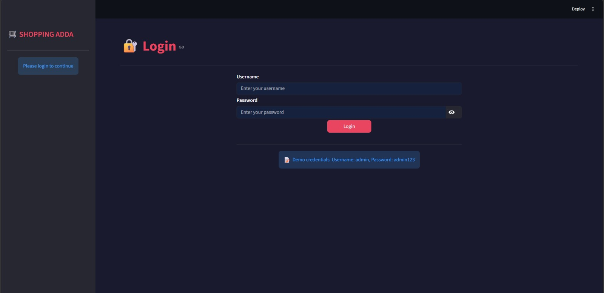
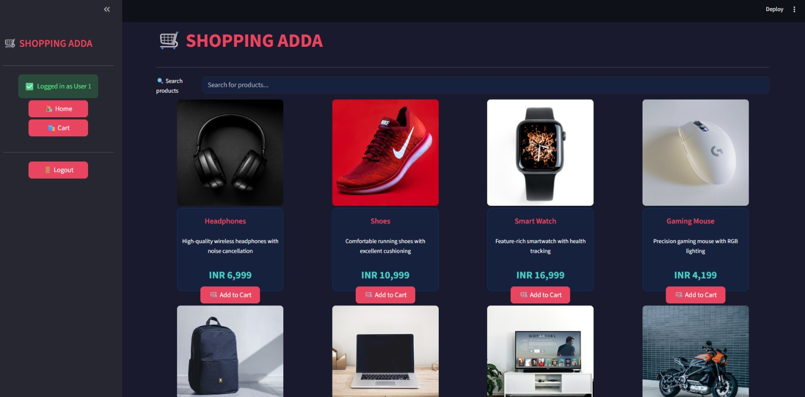
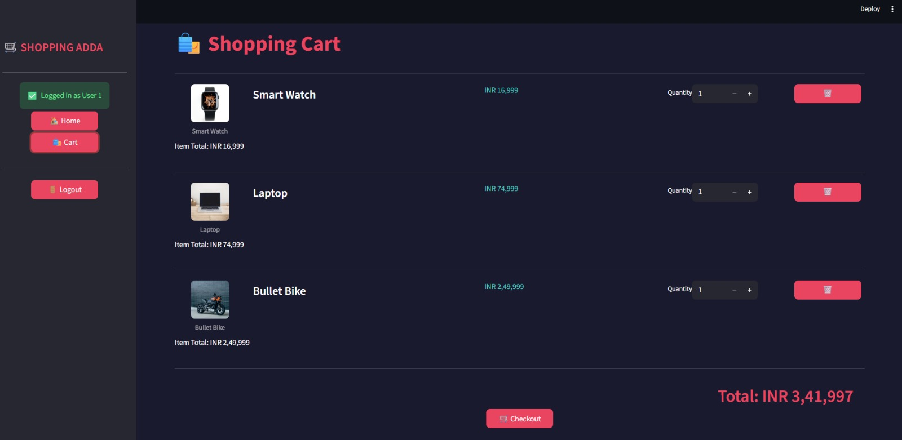

# 🛒 Ecommerce Management System

A simple **Ecommerce Management System (Shopping Adda)** built using **Python, Streamlit, and SQLite**  
This project allows users to view products, add items to cart, and manage basic ecommerce operations.

---

## 🚀 Features

- 📦 Product listing
- 🛒 Add to cart functionality
- 🗑️ Remove items from cart
- 💾 SQLite database integration
- 🎨 Simple Streamlit UI
- ⚡ Fast and lightweight app

---

## 🛠️ Tech Stack

- Python 🐍
- Streamlit 🎈
- SQLite 🗄️
- Pandas 📊
- PIL (Pillow) 🖼️

---

## ▶️ How to Run

Open terminal in project folder and run:

pip install -r requirements.txt  
streamlit run app.py

---

## 👨‍💻 Author

Ajay Rawat

## 📸 Screenshots

---

### 👤 Login Page

### 🏠 Home Page

### 🛒 Cart Page

---

## 📌 Note

This is a beginner-friendly project built for learning Python, Streamlit, and SQLite.
